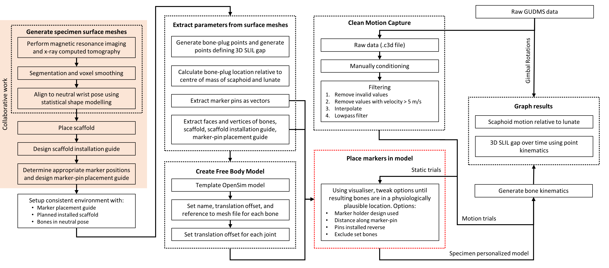

# Repository containing data processing pipeline for article 'Robotic Evaluation of a 3D-Printed Scaffold for Reconstruction of Scapholunate Interosseous Ligament Rupture: A Biomechanical Cadaveric Study'
Alastair Quinn 2019-2024

### Preface
The code in this repository was not developed with public use in mind, and is not intended for further use but proof of data. If you are unfortunate enough to read through the code, I apologise in advance and wish you the best of luck.
Throughout developing the code there were many attempts at solving particular problems with different approaches. Therefore, there may exist multiple methods to solve the same problem. Each method may appear to achieve the same result but in fact there will be subtle differences in either the computation performance or result.

## Data
### Inputs:
 - Raw motion capture data of clusters of 3 markers attached to scaphoid, lunate, 3rd metacarpal, and radius.
 - Rotation of robotic end effector.
 - 3D surface meshes of bones, scaffold, and marker-pin placement guide.

### Outputs:
 - Motions of the bones, relative to robot and each other.
 - Distance between scaphoid and lunate in 3D space over time/wrist manipulation.
 - Static measures of SL gap and angle at various wrist poses.

## Processing Pipeline

The entire code base in this repository was developed solely by Alastair R.J. Quinn with the use of publicly available Python packages and 3D mesh software. Only some data generated from the highlighted 'Collaborative work' (in the above diagram) is included in this repository to prove the published results can be generated. The scaffold designs have been removed from the codebase and only the points of interest remain, known as bone-plug points.


## Usage

### Dependencies
Python 3.10-64 and various packages (see [requirements.txt](requirements.txt)), OpenSim 4.2, and one mesh editor. The complete pipeline was developed with Materialise [3-matic®](http://www.materialise.com/en/software/3-matic)(version 14.0, and tested on 18.0) `trimatic` python API. However, [3D Slicer](https://www.slicer.org/) is a free alternative and part of the pipeline does work using its Python API.

Specific versions of 3-matic require specific versions of Python, so you will need to build OpenSim 4.2 from source with a specific python version if you want to run the entire pipeline together.
<details>
<summary>Example script to compile OpenSim 4.2 with custom Python version</summary>

``` powershell
# OpenSim 4.2
# C:\local\opensim_4_2_with_python_3_10\opensim_install\bin
mkdir C:\local
cd C:\local

mkdir opensim_4_2_with_python_3_10
cd opensim_4_2_with_python_3_10
git clone https://github.com/opensim-org/opensim-core
cd opensim-core
git checkout tag/4.2
cd ..
mkdir opensim_dependencies_build
cd .\opensim_dependencies_build
cmake ..\opensim-core\dependencies                               `
    -G"Visual Studio 16 2019"                              `
    -DCMAKE_INSTALL_PREFIX="..\opensim_dependencies_install"     `
	-DSUPERBUILD_ezc3d=ON

cmake --build . --config RelWithDebInfo -- /maxcpucount:12
cd ..
mkdir opensim_build
cd .\opensim_build
cmake ..\opensim-core                                            `
    -G"Visual Studio 16 2019"                              `
    -DCMAKE_INSTALL_PREFIX="..\opensim_install"                  `
    -DOPENSIM_DEPENDENCIES_DIR="..\opensim_dependencies_install" `
    -DBUILD_JAVA_WRAPPING=OFF                                    `
    -DBUILD_PYTHON_WRAPPING=ON                                   `
    -DPYTHON_EXECUTABLE:FILEPATH=C:\Users\theal\AppData\Local\Programs\Python\Python310\python.exe          `
    -DPYTHON_NUMPY_INCLUDE_DIR=C:\Users\theal\AppData\Local\Programs\Python\Python310\Lib\site-packages\numpy\core\include `
    -DWITH_BTK=ON                                                `
	-DOPENSIM_C3D_PARSER=ezc3d

cmake --build . --config RelWithDebInfo -- /maxcpucount:12
ctest --build-config RelWithDebInfo --parallel 12
cmake --build . --config RelWithDebInfo --target install -- /maxcpucount:12
```

</details>

### Install Python global packages for 3-Matic to work
``` python
py -3.10-64 -m pip install -r .\requirements_3_matic.txt
```

### Install Python virtual environment
``` python
py -3.10-64 -m venv .slil
```
Activate virtual environment and install dependencies
``` python
.\.slil\Scripts\Activate.ps1
pip install -r .\requirements.txt
```
If using VS Code interactive editor, you will need to restart it to ensure everything installed correctly.

Some processes have been parallelised using [ray.io](https://www.ray.io/), so can be run on other machines. Start ray head node using:
``` python
.\.slil\Scripts\Activate.ps1
# Change IP address
ray start --head --block --node-ip-address=localhost
```
However all code should work on a single machine by default without manually starting a ray.io server. (depending on the ray.io version depends how it's automatically started, so maybe run the above command locally anyway)

## Run pipeline

The files `dev_v....` and `plot_ ...` contain functions for debugging or development of an idea which never finished. Each file is quite messy and the cell for completing that step is usually in the first few cells. These have been left in for the curious, they are not required to run the pipeline.

### dev_v_final.py
The final pipeline can be run using the [dev_v_final.py](/dev_v_final.py) script, all data is stored under the `data` directory, with outputs put in the `data\data_processed_0` directory. This process can take between 3 hours and 7 hours depending on the computers compute speed and processor count.

### 1 - Setup processing data

#### Cleaned Motion Capture
The raw motion capture files have been manually checked and cleaned using a custom program, [Interactive_MoCap_editor_v4.py](app\MoCap_editor\Interactive_MoCap_editor_v4.py). The raw/original files are in [data_original.zip](data\data_original.zip), and the data passed into the pipeline are under [data\data_cleaned](data\data_cleaned).

#### Construct 3-matic environments for each model/experiment/hand

For each experiment, a single 3D mesh environment was created, containing the neutrally-aligned bones, install-positioned scaffold (redacted from public domain), marker-pin installation guide, and resulting expected marker pin locations. These 3D mesh environments are 3-matic project files located under [data\models_3_matic\EXPERIMENT_ID\version2.mxp](data\models_3_matic\11525\version2.mxp). These files cannot be generated automatically as some processes to extract variables of interest still require user input as the 3-matic API is only so good.

#### 1.1 - Setup output directory structure and OpenSim models
There are three OpenSim models per experiment (wrist_normal.osim, wrist_cut.osim, wrist_scaffold.osim) as the motion capture markers had to be removed and re-attached at least twice during the experiment to allow surgical processes.

#### 1.2 - Filter cleaned motion capture data and convert from .log files to .c3d files

#### 1.3 - Generate meaningful 3D points and lines from meshes
This includes generating:
 - Mesh files (.stl) of each bone.
 - Coordinate system for each bone (centre of mass and roughly aligned to global axes).
 - Two points for 3D SLIL gap.
 - Insertion point and ray direction for each marker pin, and expected marker location for each marker cluster.
Additionally, all .c3d trial files were rigidly rotated and translated to align to the same global reference frame and roughly zero-point origin. And motions were made relative to the radius (for easier visualisation).

### 2 - Aligning marker data to models

There were many attempts at aligning the marker data to the models (contained in [dev_v1_align_optimizers_batch](/dev_v1_align_optimizers_batch.py) and [dev_v1_align_optimizers_dev](/dev_v1_align_optimizers_dev.py)). There are some reasons why these optimization techniques were developed but ultimately the rational for using them was not justified and their results were sparse. In the end the markers were aligned using manual parameters using a visualisation GUI to quickly check the resultant bone alignment.

### 3 - Compute the bone motion using inverse kinematics
There is an external executable written with OpenSim C++ API which parallelises the inverse kinematics and point kinematics. It is the fastest method to run IK.

### 4 - Tabulate results and generate graphs
Output graphics are found in the [data\data_processed_0\outputs\graphics](data\data_processed_0\outputs\graphics) directory.
Discrete results from the motion data are saved in [data\data_processed_0\outputs\discrete_results.xlsx](data\data_processed_0\outputs\discrete_results.xlsx).

### 5 - Radiographic Measures

The radiographic measures were performed manually using a custom GUI, located [app\radiograph_converter\radiograph_convert.py](app\radiograph_converter\radiograph_convert.py). This GUI uses kinematic files, OpenSim models, and the bone mesh files to replicate a radiographic imaging system. You can scroll through time but the measures for the publication are only performed on the first frame of each trial to capture static poses.
The outputs were saved to [data\radiography_measures.xlsx](data\radiography_measures.xlsx).

### Other technical details
The [data_configs.py](/slil/common/data_configs.py) file contains all publishable (i.e., excluding redacted content) details of each experiment. Including: trial names, marker pin arrangement, scaffold dimensions, and names of supporting meshes.

The raw output data from experiments (e.g., robot motion and motion capture data) are in `.csv` files output from a [custom robotic system](https://doi.org/10.1016/j.jbiomech.2023.111557). The motion capture data was manually checked for errors due to environment reflections using the [Interactive_MoCap_editor](/app/MoCap_editor/Interactive_MoCap_editor_v4.py) and adjusted if needed. Then filtered using [this](/slil/filtering/filter_v4.py) file (fixed reflections, interpolated and lowpass filtered with 2nd order Butterworth filter with 0.5 Hz cut off frequency), which outputs `.c3d` files.

At various stages of the pipeline `.pkl` files are used to cache results of heavy computations (so they don't need to be recomputed at later stages and the pipeline can be resumed if needed).

There includes an inverse kinematics function implemented in Python that produces results similar to OpenSim. This was developed so simple free-body models could be used in custom optimization routines without the need to call OpenSim API, computationally an expensive step if everything else is not in OpenSim. OpenSims inverse kinematics is used for computing the final published data.

There are many plotting files as there are many ways to plot motion data, depending what information is to be conveyed.


## Credit
If this software is used elsewhere, please credit it by referencing the published article 'Robotic Evaluation of a 3D-Printed Scaffold for Reconstruction of Scapholunate Interosseous Ligament Rupture: A Biomechanical Cadaveric Study' or this repository and its author.